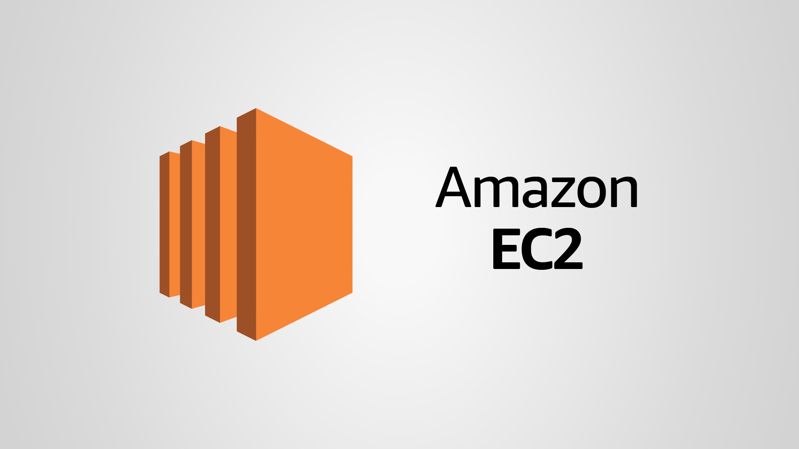

# Relatório de Acesso à Amazon EC2 

  Imagem 1 - Amazon EC2 Logo
  
  Fonte: ITExperts (2022)

## Introdução
<conteúdo>

## Objetivo
<conteúdo>

## Materiais
<conteúdo>

## Método

&emsp;Para inicializar uma instância na Amazon EC2, o primeiro passo é nomear a instância, como mostra a **Imagem 2**. Isso envolve atribuir um nome descritivo à instância para facilitar a identificação posterior.

  Imagem 2 - Nomeando a Instância
  
  Fonte: Autoria própria

&emsp;Em seguida, é necessário criar um par de chaves. Esse par de chaves consiste em uma chave pública e uma chave privada. A chave pública é usada para criptografar dados que só podem ser descriptografados pela chave privada correspondente.  Este par de chaves é crucial para autenticar e acessar a instância de forma segura.[3]

  Imagem 3 - Creating Key Pair .ppk
  
  Fonte: Autoria Própria

&emsp;Após a criação do par de chaves, é necessário configurar as regras de segurança do grupo de segurança associado à instância para permitir o tráfego HTTP/HTTPS. Um grupo de segurança da AWS atua como um firewall virtual para suas instâncias EC2, controlando o tráfego de entrada e saída.[1]

  Imagem 4 - Permitir Tráfego HTTP/HTTPS
  
  Fonte: Autoria Própria

&emsp;Uma vez configuradas as regras de segurança, a instância pode ser iniciada. Isso envolve iniciar a máquina virtual na nuvem da Amazon EC2, usando as configurações especificadas, como tipo de instância, tamanho, sistema operacional, etc. Durante esse processo, a instância é provisionada e preparada para ser executada.

  Imagem 5 - Instância Iniciada
  
  Fonte: Autoria Própria

&emsp;Nesta imagem, é mostrada a interface de gerenciamento da Amazon EC2, mostrando uma instância que está em execução. Isso significa que a máquina virtual associada a essa instância foi inicializada com sucesso e está pronta para ser utilizada. É possível ver informações importantes, como o ID da instância, tipo, status, endereço IP público, entre outros.

  Imagem 6 - Instância em Execução
  
  Fonte: Autoria Própria

&emsp;Esta imagem mostra o aplicativo PuTTY, uma ferramenta que dá possibilidade de acessar servidores remotos via SSH, com uma captura de tela mostrando a configuração do hostname. O hostname é o nome atribuído a um dispositivo na rede.

  Imagem 7 -Adicionando Hostname no PuTTY
  
  Fonte: Autoria Própria

&emsp; Após isso, a chave privada é inserida no painel SSH/Auth para a autenticação. Com isso, o PuTTY está configurado para usar uma chave privada específica para autenticação, garantindo um acesso seguro à instância remota. 

  Imagem 8 - Adicionando Pair Key no PuTTY
  
  Fonte: Autoria Própria

&emsp; Finalizando o processo, foi realizado um login através do console com "ec2-user" e a instância foi acessada com sucesso. 

  Imagem 9 - Print no Console
  
  Fonte: Autoria Própria

## Resultados
<conteúdo>

## Conclusão
<conteúdo>

## Referências
1. CHECK POINTS SOLUTION. **What is AWS Security Groups**. Disponível em: <https://www.checkpoint.com/cyber-hub/cloud-security/what-is-aws-security-groups/#:~:text=An%20AWS%20security%20group%20acts>. Acesso em: 24 fev. 2024.  
2. ITEXPERTS. **EC2: Saiba mais sobre esta solução da Amazon AWS**. Disponível em: <https://www.itexperts.com.br/blog/tecnico/amazon-ec2/>. Acesso em: 22 fev. 2024. 
3. QUORA. **What is the purpose of key pair with Amazon AWS EC2?** Disponível em: <https://www.quora.com/What-is-the-purpose-of-key-pair-with-Amazon-AWS-EC2#:~:text=Amazon%20EC2%20uses%20public>. Acesso em: 24 fev. 2024. 